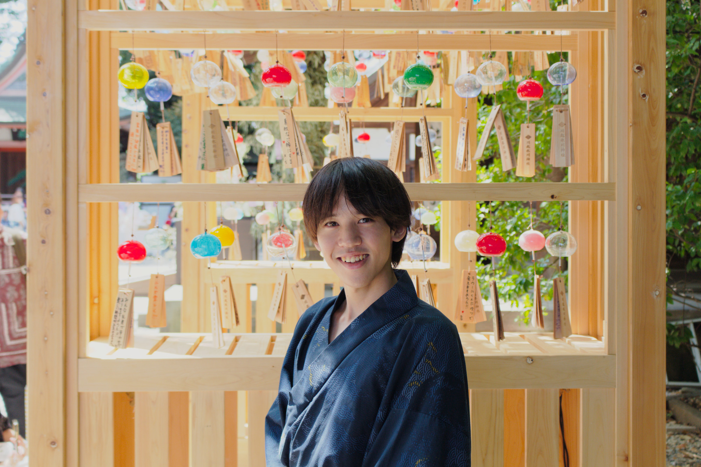

# 長谷 玄武 (Genbu Hase)

## 📊 Stats

  
  

## 🔧 Skills

### Languages

and Visual Basic, VBA, VBS, Google Apps Script (GAS), SQL, etc.

### Frameworks and Libraries

### Platforms

### Services

### Others

| 時期       | 内容        |
| :--------- | :--------- |
| 2016/02    | 日本漢字能力検定 準2級を取得 |
| 2016/11    | 実用英語技能検定 2級を取得 |
| 2018/12    | 語彙・読解力検定 2級を取得 |
| 2020/11    | 実用英語技能検定 2級を再度取得 |
| 2022/02    | TOEIC Listening & Reading Testにて770点を取得 |
| 2025/03    | 小学校教諭一種免許状を取得 |
| 2025/03    | 特別支援学校教諭一種免許状を取得 |
| 2025/03    | 中学校教諭一種免許状(英語)を取得 |
| 2025/03    | 高等学校教諭一種免許状(英語)を取得 |
| 2025/03    | 幼稚園教諭二種免許状を取得 |
| 2025/11    | 生成AI活用普及協会(GUGA) 生成AIパスポート資格を取得 |

## 🕴️ Careers and Activities

| 時期       | 内容        |
| :--------- | :--------- |
| 2021/04    | 埼玉大学 教育学部 学校教育教員養成課程 特別支援教育コースに入学 |
| 2021/11    | 埼玉大学手話サークル ゆびつむぎを創設し、同団体代表に就任 |
| 2022/03    | 埼玉大学手話サークル ゆびつむぎ 第2期代表に就任 |
| 2022/10    | 埼玉大学総務部 広報渉外課 埼大学生広報サポーター 第1期生に就任 |
| 2023/01    | 埼玉大学手話サークル ゆびつむぎ主催「日本手話言語講座」プロジェクトを発足 |
| 2023/03    | 埼玉大学手話サークル ゆびつむぎ 第3期広報部長に就任 |
| 2023/04    | 埼玉大学 教育学部 特別支援教育コース 2023年度 裏ガイダンスを新規に企画・実施 |
| 2023/07    | 埼玉大学学生団体FP主催「Saidai Contest 2023」に出場 |
| 2023/11    | 埼玉大学学生団体FP主催「Saidai Contest 2023」にて準グランプリ・うどん県賞を受賞 |
| 2024/01    | 学生団体MARKS・株式会社エイジ・エンタテインメント主催「MR OF MR CAMPUS CONTEST 2024」に出場 |
| 2024/03    | 埼玉大学手話サークル ゆびつむぎ 第3期広報部長を退任 |
| 2024/03    | 埼玉大学メイド部を創設し、同団体代表に就任 |
| 2024/04    | 埼玉大学 教育学部 特別支援教育コース 2024年度 裏ガイダンスを企画・実施 |
| 2024/09    | 埼玉大学教育機構 障がい学生支援室 障がい学生サポーター／パソコンノートテイカー 第1期生に就任 |
| 2024/12    | 埼玉大学メイド部 第1期代表を退任 |
| 2025/03    | 埼玉大学総務部 広報渉外課 埼大学生広報サポーターを退任 |
| 2025/03    | 埼玉大学教育機構 障がい学生支援室 障がい学生サポーター／パソコンノートテイカーを退任 |
| 2025/03    | 埼玉大学 教育学部 学校教育教員養成課程 特別支援教育コースを卒業 |
| 2025/04    | Webエンジニアとして都内某IT企業に従事 |
| 2025/04    | 埼玉大学手話サークル ゆびつむぎ主催「日本手話言語講座」プロジェクトの一環として、新たに埼玉大学教育機構に[講座「AL2(日本手話を学ぶⅠ)」](https://syllabus.risyu.saitama-u.ac.jp/syllabusHtml/2025/06/06_XZ600331_ja_JP.html)を開講 |

## 👤 Contacts

### Twitter (Currently 𝕏)

* [長谷 玄武 / Genbu Hase (@GenbuHase)](https://twitter.com/GenbuHase)
* [めんつゆ。 (@SU_Mentsuyu)](https://twitter.com/SU_Mentsuyu)
* [どっかのげんちゃん。 (@GenInAnywhere)](https://twitter.com/GenInAnywhere)

### Instagram

* [長谷 玄武 / Genbu Hase (@genbuhase)](https://www.instagram.com/genbuhase)
* [どっかのげんちゃん。 (@programmergenboo)](https://www.instagram.com/programmergenboo)
